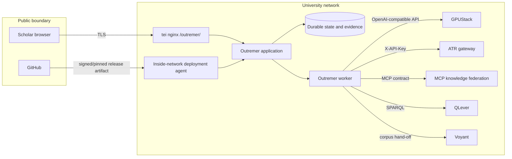

# ADR 0001: University production deployment and shared research capabilities

- **Status:** Proposed — human approval required before infrastructure mutation
- **Date:** 2026-08-11
- **Decision owners:** Outremer maintainers and University of Bern DH infrastructure
- **Tracking:** #110, Epic #116
- **Machine-readable companion:** [`../deployment/capabilities-v1.yaml`](../deployment/capabilities-v1.yaml)

## Context

Outremer currently builds a static research interface and runs scheduled work in
GitHub Actions. GitHub-hosted runners cannot reach University of Bern services;
live model calls therefore fail or degrade to heuristic extraction. That is a
useful offline test mode, but it is not an acceptable production publication
path.

The production system will run inside the university network on
`tei.dh.unibe.ch`. It can reuse capabilities operated for
[`thodel/agentic_historian`](https://github.com/thodel/agentic_historian):
GPUStack inference and retrieval models, the ATR recognition gateway, MCP
knowledge sources, QLever, Voyant, and selected tool contracts. Outremer's
evidence-first records, prosopographic authority model, evaluation, and
scholarly review semantics remain authoritative.

This ADR defines boundaries and contracts. It does **not** authorize a bot to
change DNS, nginx, systemd, firewall rules, credentials, or production data.

## Decision

### 1. Deployment shape

Outremer will be a versioned application plus worker behind the existing nginx
service. Its external base URL is configurable; the proposed value is
`https://tei.dh.unibe.ch/outremer/`. The application must never assume ownership
of `/` or use unqualified root-relative assets.

Production inference and publication run inside the university network. GitHub
Actions remains responsible for offline linting, unit/contract tests, fixture
evaluation, and build artifacts. An approved inside-network runner or deployment
agent performs live integration checks and release promotion (#112).

Mutable research state is separated from immutable releases:

- release: application, static assets, schemas, migrations, dependency lock;
- state: evidence, review decisions, run state, provenance and audit events;
- source: uploaded or mounted research material, governed independently;
- cache: reproducible/disposable derived data;
- secrets: host-managed credentials, never repository files or manifests.

### 2. Integration rule: contracts, not repository internals

Shared infrastructure is consumed through network contracts or a shared,
version-pinned package. Outremer must not import `agentic_historian`'s Discord
bot, repository-relative modules, or deployment state. Issue #90 decides the
general sharing mechanism; this ADR constrains the result as follows:

- network services (GPUStack, ATR, MCP, QLever, Voyant) use narrow adapters with
  health/version discovery, timeouts, authentication and contract tests;
- genuinely shared clients may use the package selected by #90/#87;
- domain model conversion happens in Outremer anti-corruption adapters;
- provider capability identifiers, not concrete model names or hosts, appear at
  domain call sites;
- resolved endpoint/service/model versions are recorded in run provenance.

### 3. Required, optional and deferred capabilities

The production profile has four classes, defined precisely in the companion
manifest:

- **Required:** application storage, GPUStack text inference, and provenance.
  Failure blocks the affected run and publication.
- **Conditionally required:** GPUStack vision and ATR are required when a source
  needs recognition; MCP knowledge federation is required when federated linking
  is selected. Failure blocks that stage rather than silently changing methods.
- **Optional:** retrieval models, QLever and Voyant until their owning issue
  promotes them. Their absence is visible and cannot erase or replace canonical
  evidence.
- **Deferred:** generic `agentic_historian` agent-tool orchestration. Reusable
  source-description, entity, corpus-analysis and reporting tools require an
  explicit Outremer adapter and scholarly-fit review in #113.

### 4. Failure and fallback policy

Production must fail visibly. In particular:

- GPUStack text failure must not silently switch to heuristic extraction;
- recognition failure must not turn an image-only source into empty text;
- MCP/QLever unavailability must be distinguishable from a successful query
  returning no candidates;
- optional tools may degrade only to a declared state displayed in the UI,
  structured logs and run provenance;
- release promotion rejects outputs whose actual engine/capability profile does
  not match the declared production profile;
- every remote call has a bounded timeout and correlation/run identifier.

Heuristic extraction remains available for offline development and explicitly
labelled comparison runs. It is not publication-grade production inference.

## Trust and network boundaries

Only nginx is intended to receive browser traffic. Internal service exposure,
ports and firewall allowlists are resolved by infrastructure owners during the
approval checkpoint. The manifest therefore uses environment references and
logical service names rather than inventing reachable public URLs.

## Data classification

- **Public:** released static site, approved evidence excerpts, published
  authority data, aggregate evaluation and non-sensitive provenance.
- **Internal:** service topology, model registry, operational metrics, detailed
  dependency health and non-public research outputs.
- **Restricted:** unpublished source material, reviewer/audit identities,
  access-controlled corpora and raw application logs that may contain content.
- **Secret:** API keys, service credentials, signing material, session secrets
  and pseudonymisation salts.

Adapters must declare the highest classification they send. Secrets are passed
by host credential/environment mechanisms and must be redacted from health,
logs, manifests, provenance and exported research packages.

## Infrastructure prerequisites and owners

Before #111–#115 change production infrastructure, a human owner must confirm:

1. external URL path, DNS ownership and TLS termination;
2. nginx routing and maximum upload/request duration;
3. dedicated unprivileged application and deployment identities;
4. firewall routes from worker to each approved internal service;
5. service authentication and credential rotation ownership;
6. durable state/source/cache paths, quotas and filesystem permissions;
7. backup target, retention, encryption, restore owner and recovery objectives;
8. logging/metrics destination, retention and restricted-data handling;
9. inside-network runner/deployment mechanism and artifact verification;
10. maintenance, incident escalation and rollback authority.

Unknown values stay `TBD` in the manifest and are **blocking**, not invitations
for bots to guess.

## Dependency matrix

| Capability or concern | Source/owner | Implementation | Validation |
|---|---|---|---|
| Deployment contracts and prerequisites | Outremer + DH infrastructure | #110 | Human ADR approval |
| Runtime packaging, nginx/systemd, state layout | Outremer | #111, #86 | Staging install/rollback |
| Inside-network release pipeline | DH infrastructure + Outremer | #112 | Live provenance gate |
| GPUStack role routing | Shared infrastructure | #88, #113 | Offline contract + live fixture |
| ATR recognition and engines | Shared infrastructure | #64, #87, #113 | #74, #77 and scanned fixture |
| MCP federation/entity resolution | Shared infrastructure | #113 | At least one live source + empty/error distinction |
| Offline authority/QLever | Shared infrastructure | #83, #113 | Snapshot/version provenance |
| Voyant corpus hand-off | DH infrastructure | #113 | Staging corpus smoke test |
| Shared-code ownership/versioning | Both repositories | #90 | Version pin + compatibility test |
| Multi-user review and durable state | Outremer | #114 | Concurrency + restore test |
| Health, telemetry and readiness | Outremer + DH infrastructure | #115 | Production rehearsal |

## Consequences

Positive consequences:

- production artifacts are generated where the declared models and services are
  actually reachable;
- both research projects can share mature infrastructure without collapsing
  their domain models or release cycles;
- missing services and methodological degradation become auditable;
- later bots have explicit contracts and ownership boundaries.

Costs and trade-offs:

- a university-network deployment path and operational ownership are required;
- contract/version management adds work compared with direct imports;
- some features remain unavailable until humans resolve infrastructure `TBD`s;
- multi-user state, backup and observability turn the proof of concept into an
  operated service rather than a static build.

## Non-goals

- replacing Outremer with the `agentic_historian` application or Discord bot;
- copying every `agentic_historian` module irrespective of scholarly fit;
- selecting exact production secrets, filesystem paths, ports or service
  accounts in source control;
- changing the Outremer evidence/authority model in this issue;
- granting bots permission to modify production infrastructure.

## Human approval checkpoint

Change this ADR from **Proposed** to **Accepted** only after the maintainers and
DH infrastructure owner approve the proposed URL, capability classifications,
sharing boundary, data classifications, and all blocking prerequisites in
`capabilities-v1.yaml`. Infrastructure issues may prepare templates beforehand,
but must not apply host changes before that approval is recorded in the PR or
issue.
